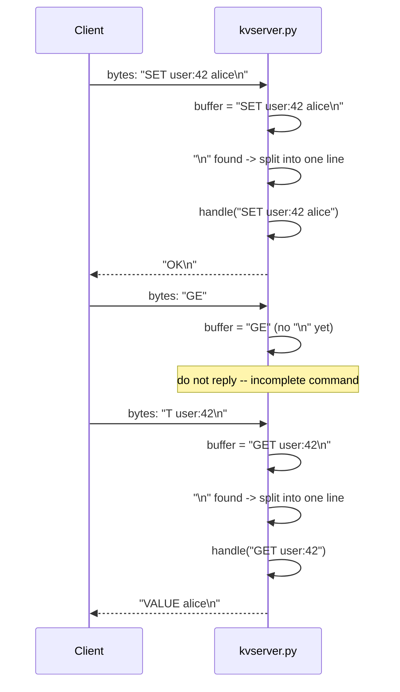
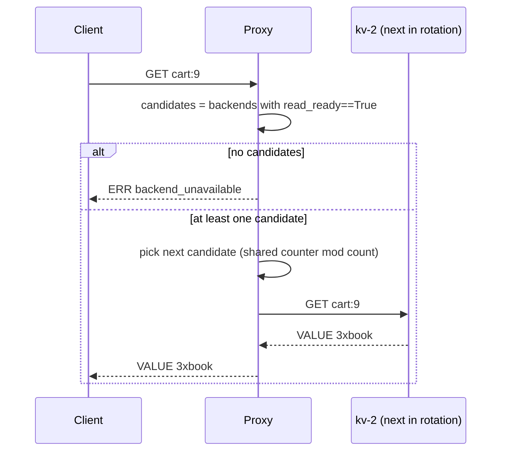
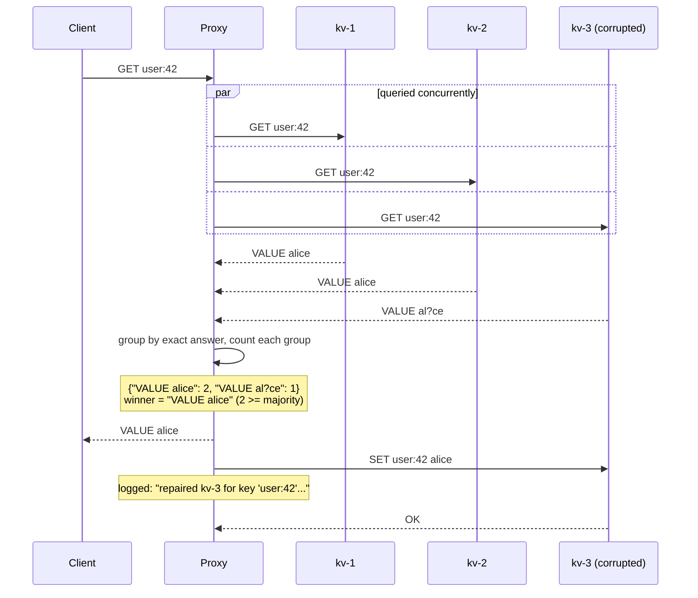
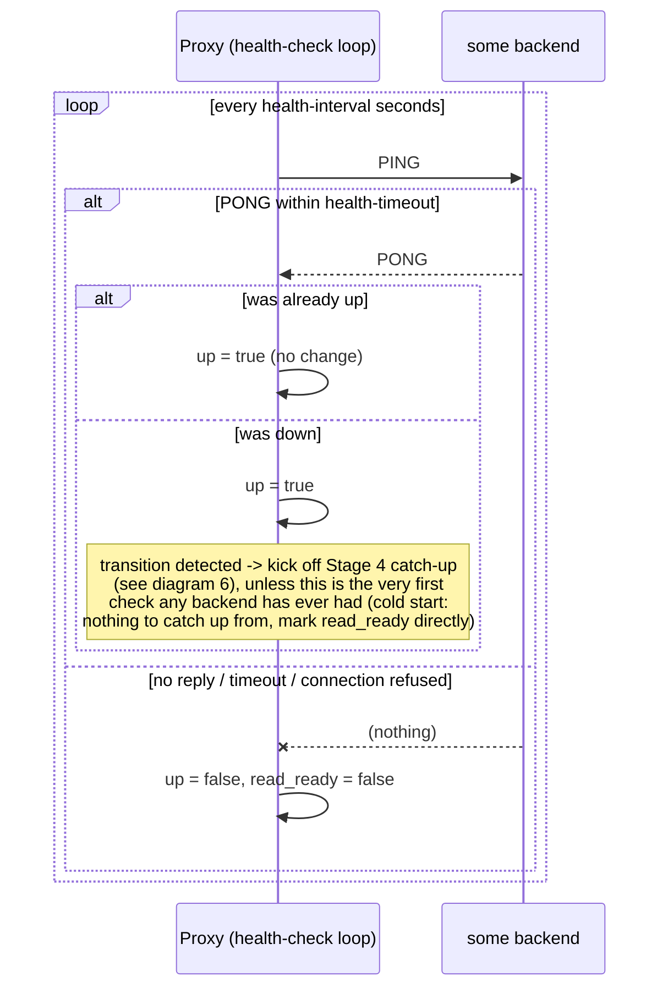
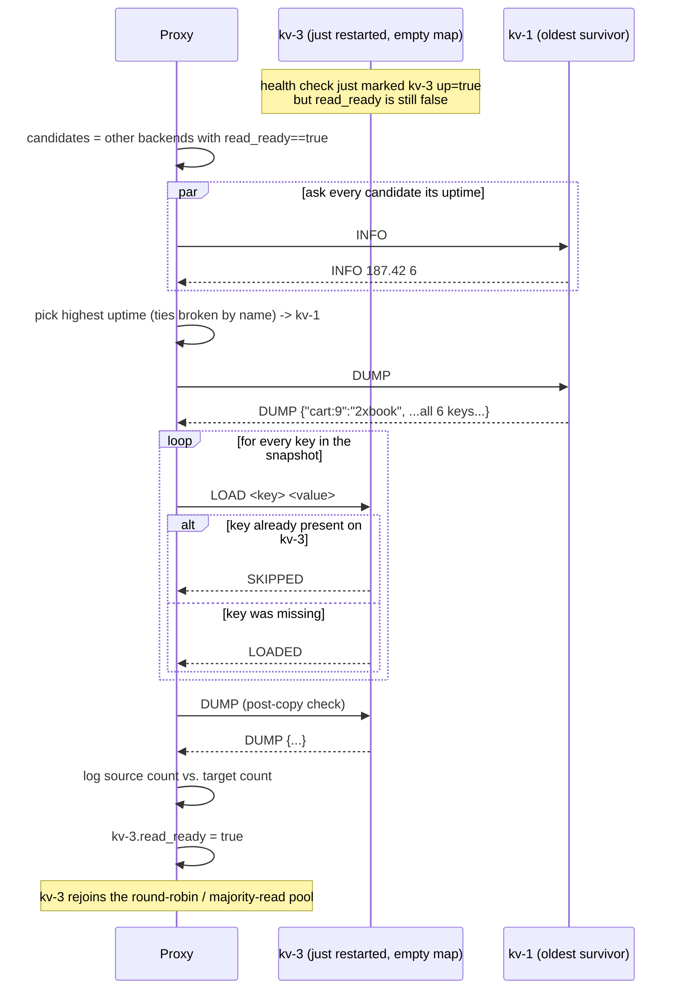
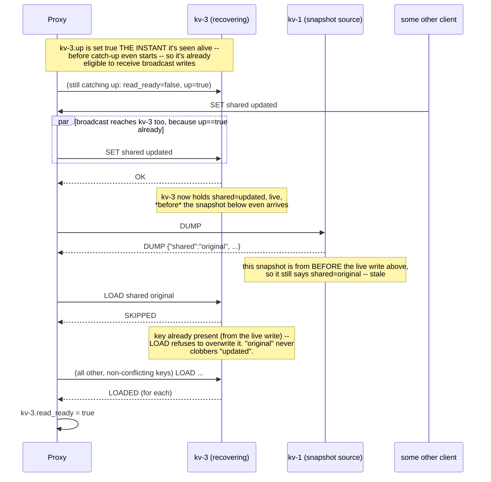

# Flow

Sequence diagrams for every path a request can take, plus the two
background loops (health-check and catch-up) that run independently of any
client request. Diagrams are [Mermaid](https://mermaid.js.org/); any
Markdown viewer with Mermaid support (GitHub, VS Code, etc.) renders them
directly — a plain-text description sits above each one too, so nothing is
lost if your viewer doesn't render Mermaid.

## Contents

1. [Byte stream → command (Stage 1 framing)](#1-byte-stream--command-stage-1-framing)
2. [SET / DEL — broadcast write](#2-set--del--broadcast-write)
3. [GET — round-robin read (Stage 3 default)](#3-get--round-robin-read-stage-3-default)
4. [GET — majority read + repair (Stage 5)](#4-get--majority-read--repair-stage-5)
5. [Health-check loop (background, always running)](#5-health-check-loop-background-always-running)
6. [Catch-up after a backend comes back (Stage 4)](#6-catch-up-after-a-backend-comes-back-stage-4)
7. [Live write racing a catch-up in progress](#7-live-write-racing-a-catch-up-in-progress)

---

## 1. Byte stream → command (Stage 1 framing)

TCP hands you bytes, not messages — a single `read()` can contain half a
command, one whole command, or three. Every connection (client↔server *and*
proxy↔backend) keeps its own buffer and only acts once a full `\n` shows up.



*Implemented in `protocol.py`'s `LineConn.read_line()`, used identically by
`kvserver.py` for client connections and by `proxy.py` for its connections
to each backend — same framing problem, same fix, in both places.*

---

## 2. SET / DEL — broadcast write

```mermaid
sequenceDiagram
    participant C as Client
    participant P as Proxy
    participant K1 as kv-1
    participant K2 as kv-2
    participant K3 as kv-3

    C->>P: SET cart:9 2xbook
    P->>P: count backends with up==True
    alt fewer than 2 up
        P-->>C: ERR write_unavailable
    else 2 or more up
        par sent concurrently, one thread per backend
            P->>K1: SET cart:9 2xbook
            and
            P->>K2: SET cart:9 2xbook
            and
            P->>K3: SET cart:9 2xbook
        end
        K1-->>P: OK
        K2-->>P: OK
        K3-->>P: OK
        Note over P: default mode waits for every backend it sent to;<br/>--quorum-write mode only waits for a majority
        P-->>C: OK
    end
```

The three `SET`s in the `par` block really do fire from three separate
threads (`proxy.py: _do_write`), not a `for` loop — a broadcast write costs
about as long as the *slowest* backend, not the *sum* of all three.

---

## 3. GET — round-robin read (Stage 3 default)



If the chosen backend's call fails outright (not just "not found" — an
actual connection failure), the proxy marks it down and retries once
against the next candidate before giving up, rather than failing the whole
read because of one stale rotation pick.

---

## 4. GET — majority read + repair (Stage 5)



If every backend disagrees (no group reaches 2), the proxy returns
`ERR no_majority` instead of guessing, and repairs nothing (there's no
majority to repair *toward*).

---

## 5. Health-check loop (background, always running)

Independent of any client request — one loop per proxy process, ticking
every `--health-interval` seconds (default 1s).



A write or read that fails on the spot marks a backend down immediately too
(see diagrams 2 and 3) — the timer isn't the *only* way a failure is
noticed, just the way a *silent* failure (nothing currently talking to that
backend) eventually gets noticed.

---

## 6. Catch-up after a backend comes back (Stage 4)

Triggered by the health-check loop's down→up transition (diagram 5), runs
on its own background thread so it doesn't block the health-check loop from
checking everyone else.



---

## 7. Live write racing a catch-up in progress

This is the wrinkle the brief calls out explicitly on Plate 4 ("writes are
still arriving during all this"). The fix is `LOAD`'s set-if-absent
semantics plus the *order* in which kv-3 is made write-eligible vs.
read-eligible.



The key mechanism: **`LOAD` is set-if-absent, never overwrite.** Any key a
live write already delivered to the recovering backend wins automatically,
because the snapshot replay simply skips it. The only way this could still
lose a write is if the *live write itself* fails to reach kv-3 for some
unrelated reason (e.g. it was mid-connect at that exact instant) — in that
narrow case the snapshot's older value would apply instead, which is the
one accepted gap in an otherwise small, dependency-free design (see
`README.md`'s "Known limitations").
